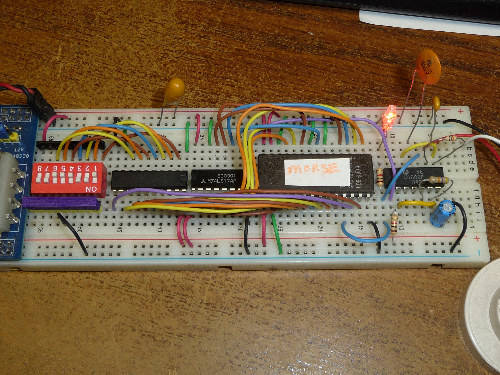

#   ROM based ASCII to Morse code converter.
   
   
   

   
---

## Features
- accepts A-Z, 0-9, and space. Not case sensitive.
- /Done signal to allow for auto loading next character to transmitt.

  
---

## Compiling the ROM generator:
``` 
  To compile the generator:  gcc *.c
  To build the ROM image:  ./a.out 
    (output is in output.bin)

```     

## writing the ROM
```
    To burn with minipro to a TMS27C128 eeprom: 
    (minipro -p TMS27C128@DIP28 -s -w output.bin)
```
This CAN be written to a ROM as small as 32kbit, but your not into 'normal' programming voltages 
until your at 64kbits, and I'm low on 2764 so I used 128.


See other projects for how to write this into unused space on an e-waste OTP ROM!
(blockfinder)


This can ALSO be easily dumped into an array and used on a microcontroller. (bit heavy on memory tho)

---

## Constructing

I used a 556 to time my unit, I have a 47k resistor from OUTPUT to the capacitor, and a 2.2uF capacitor. I think this 
results in about a 1/10sec slot time.(a dot is 2 slots [10], a dash is 4 slots [1110])  


I used the second oscillator in my 556 for a morse tone generator, with R = 15k and C = .047uF
  
  

  
 
---
  Questions?
    
``` twitter @ruenahcmohr ```
``` https://infosec.exchange/@RueNahcMohr ```
``` https://bsky.app/profile/ruenahcmohr.bsky.social ```


<br>
<br>

 
 


